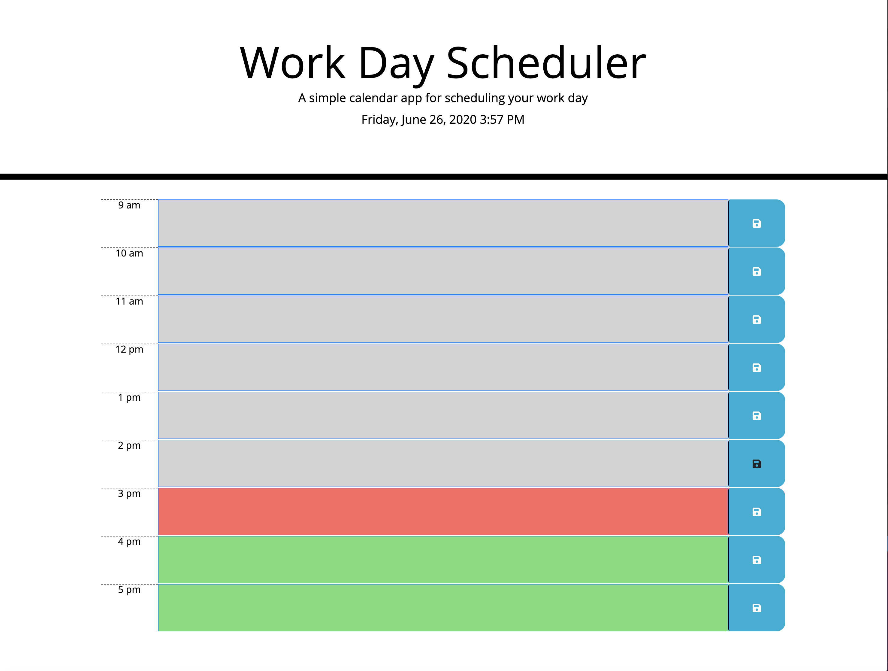

# Scheduler
I had to use a lot of outside resources and help to get this assignment done in the short time frame I had to complete it.  I spent most of my time trying to learn and understand what everything is doing.  I think I have a slightly better grasp on some but I still have a ways to go.  But it's coming slowly so that gives me some hope.  I still don't feel like I can start with a blank document and make a functioning, user-interactive, user-friendly, appealing website.  But it will come.  I'm just going to keep plugging away. 

## HTML
The majority of the html was given.  Bootstrap was used to make the rows and columns for the calendar.  I think back to the bootstrap assignment just a couple of weeks ago and it was so difficult to understand and get done.  Now, for this assignment throwing it in and getting it to work was almost an after thought.  I just had to make sure the id's and classes matched some of the css formats that were being called.  Then just made a few adjustments to the formatting. 

## CSS
The most difficult part of the CSS was getting the classes put into the HTML so the formatting was done correctly. 

## JS/JQuery 
Now this is where it gets difficult.  I'm still trying to wrap my head around all the functions and how they all work.  Then, we put JQuery in it and that's even more to know.  I'm still working on all of that.  I think with time, practice, and reading a lot of code it will all continue to make more and more sense.  I was able to get everything to work in the scheduler except for the text in the localStorage.  I can see in the console that the key/value pairs are being saved but for some reason I can't get the input from the user to store and stay even after refresh.  I'm going to continue to try and figure this out and get it working how it is supposed to. 

## Link
https://dylandewey.github.io/Scheduler/

